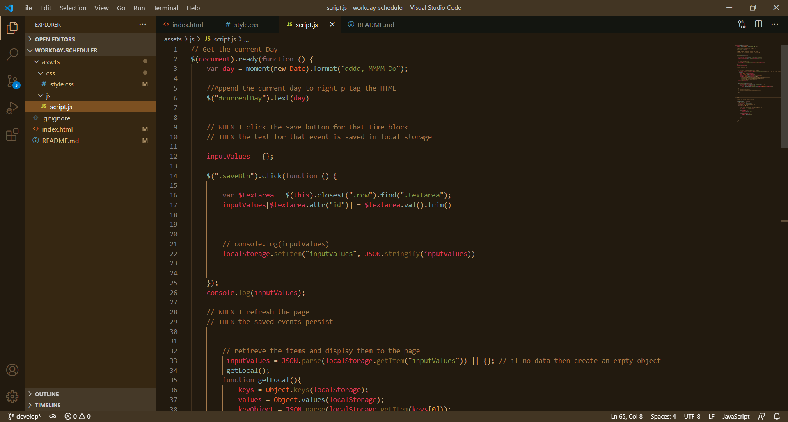

# Work Day Scheduler Starter Code
## HMTL
* create static buttom elements for icon within the row
* Add CDN for icon https://code.iconify.design/1/1.0.7/iconify.min.js t
## BOOTSTRAP
* Use bootstrap to implement rows and columns
* Use bootstrap classes to provide to style
## JavaScript/Jquery
* create a new js file and link it to HTML
* Use Jquery to create funcionality
## Code PROCESS
* Use static p element to apply current day in the header using moment
* color code each timeblock by using a for loop comparing it to the currentHour
* add classes based on condition in for loop
* create on click function to target the textarea 
* retrieve the input values form that textarea from the id and set into local storage 
* save them as an object
* retrieve the data from local storage and loop through each one 
* On refresh the same input values are placed back into their desginated hour
## CSS
* Add custom CSS to the page 

Deployed link: 

 

